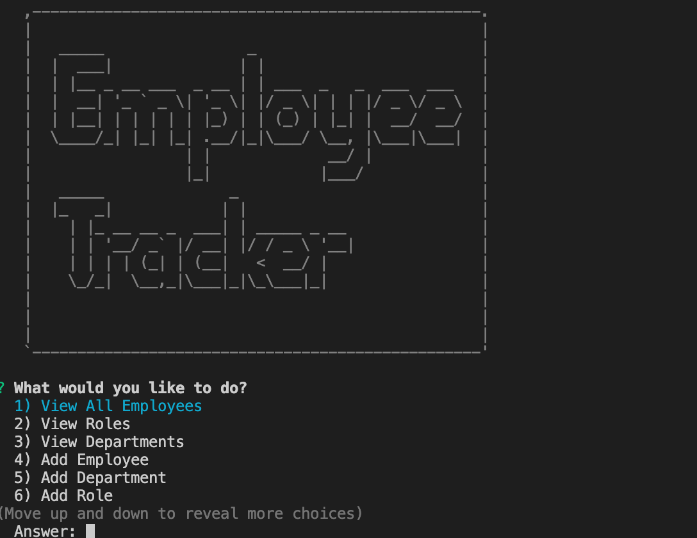
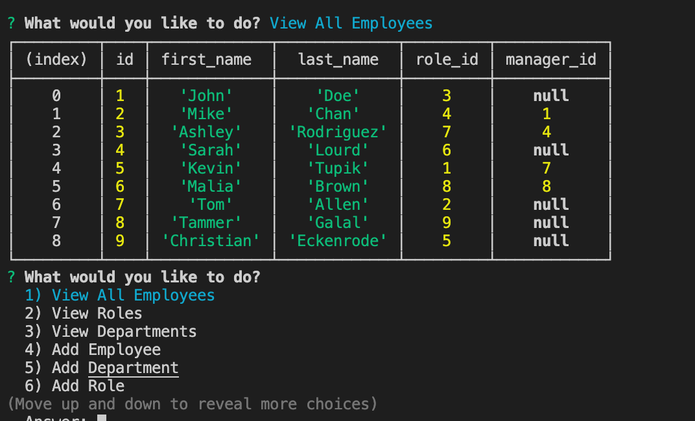

# Employee-Tracker

For this assignment, we are tasked to create a command-line application that manages a company's employees using node, inquirer and MySQL. This application allows the user to add departments, roles and employees, view departments, roles and employees and update employee roles.

## Contents

This application consists of 1 main page, server.js. It also has a db folder which has the schema and seeds files for MySQL and the package.json files. It also has an images folder which contains the images that are used for the README.

## User Story

As a business owner 
I want to be able to view and manage the departments, roles, and employees in my company 
So that I can organize and plan my business 

## Screenshots & Video

<a href="https://drive.google.com/file/d/1h6lIGmEnr2Lg09gRAxJHVMj95Ma20J8v/view?usp=sharing">Demo</a>

## Usage

To use this application, first clone this repository. Once you have cloned the repository, run npm install to install the following packages that is a dependancies which is stated in the package.json file.

- inquirer
- MySQL
- asciiart logo

The application itself can be invoked with the following command.

npm start

## Built With

- VS Code (https://code.visualstudio.com/)
- Terminal
- MySQL
- Inquirer

## License

This application does not have a license.

## Author

Chloe Blackwell 
Email: chloeblackwell2@hotmail.com
